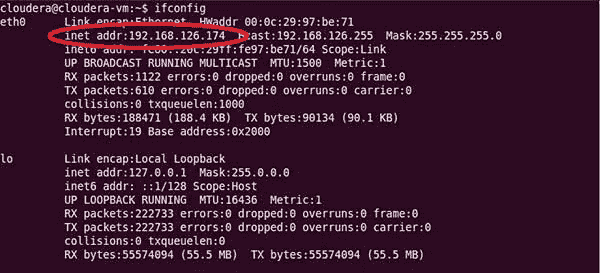
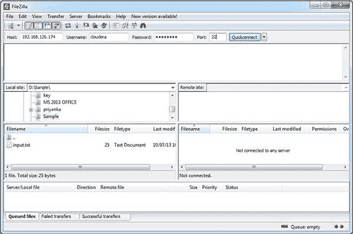
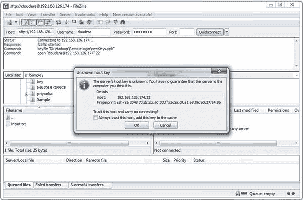
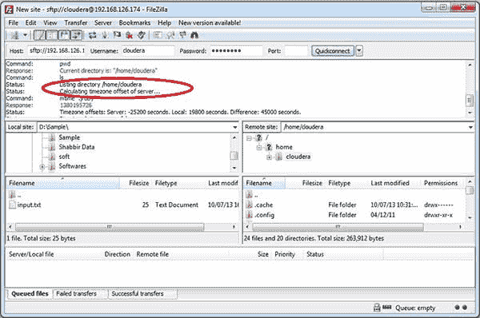
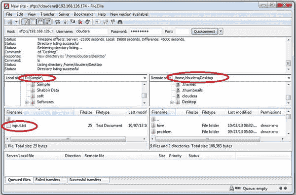
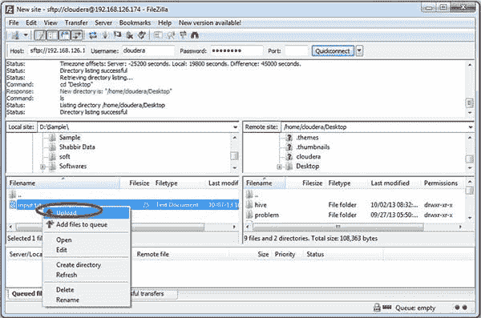
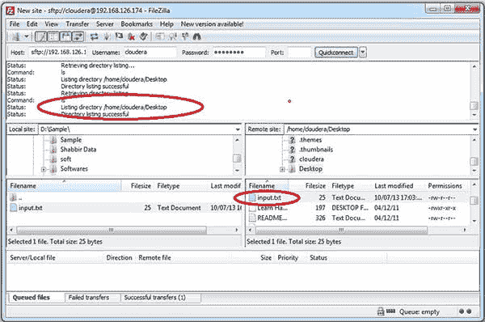

# 将文件从 Windows 传输到 Cloudera 演示虚拟机

> 原文：<https://www.edureka.co/blog/windows-to-cloudera-demo/>

本博客描述了从 *windows* 到*cloud era Demo VM*的 *传输* 文件的逐步过程。要完成这个任务，你需要一个 *FTP(文件传输协议)* 软件比如 **FileZilla** 或者 **WinSCP** 。在这篇博客中，我们将使用 *FileZilla* 来演示整个过程。

## **将文件从 Windows 转移到 Cloudera 演示虚拟机的教程**

**第一步:下载安装 FileZilla**

*   打开**FileZillaT5。将出现以下屏幕:**

**第二步:建立与 Cloudera 的连接 T3**

为了建立连接，我们需要四个参数:

*   **主机名** :在这个字段我们应该给出 Cloudera 的 IP 地址。
*   **用户名** :这是 Cloudera Demo VM 的用户名。默认是‘cloud era’。
*   **密码** :默认情况下，Cloudera 演示虚拟机的密码为‘cloud era’。
*   **端口号** r:我们需要提及端口号来访问 *Cloudera 演示虚拟机上的文件传输服务。因为是 SSH 连接，所以使用端口号**‘22’**。*

在 Cloudera 演示虚拟机中找到主机的 IP 地址。在 Cloudera 中打开一个终端，执行以下命令: **ifconfig**

显示*主机 IP 地址*，如下图:

图中圈出的数字是你的 *Cloudera 主机*的 *IP 地址*。

现在，我们有了需要为*窗口*和 *FileZilla 连接*指定的所有四个值。 ***取值有:***

**主机:** 192.168.126.174 **用户名:** cloudera **密码:**cloud era***端口号:** 22*

在 ***FileZilla*** 的相应字段中更新这些参数，并点击 ***快速连接*** ，如上图所示。

点击 ***快速连接*** 后，会弹出如下图所示的信息。

点击**确定。**

您将收到一条消息，通知您连接成功。

在上图中可以看到，在*左侧*面板下，列出了 *Windows* 的那个目录下存在的目录和文件，在 FileZilla 的*右侧*面板下，列出了 *Cloudera* 的那个目录下存在的目录和文件。

**第三步:将文件转移到 Cloudera。**

在您的*本地系统*上选择包含您想要传输到 *Cloudera* 的文件的目录。 我们将把位于位置**‘D:sample’的文件**“input . txt”**传输到 Cloudera VM 主机**。

同样，选择您要将“input.txt”文件转移到的 Cloudera 的*位置/目录*。 我们将文件转移到 Cloudera 主机的桌面。

右键点击 ***input.txt*** 文件点击**选项【上传】**。

观察 Cloudera 主机桌面下的文件 *" **input.txt** "* 如下图所示。您还会收到图像中高亮显示的 ***成功** **状态*** 图像。

恭喜你！您已成功将文件从 Windows PC 传输到 Cloudera 演示虚拟机主机。

*有问题吗？请在评论区提到它们。*

**相关帖子:**

[在亚马逊 EC2 上安装 Hadoop 集群](https://www.edureka.co/blog/install-apache-hadoop-cluster/ "Install Apache Hadoop Cluster on Amazon EC2 free tier Ubuntu server in 30 minutes")

[有用的 Hadoop Shell 命令](https://www.edureka.co/blog/helpful-hadoop-shell-commands-2/ "Helpful Hadoop Shell Commands")