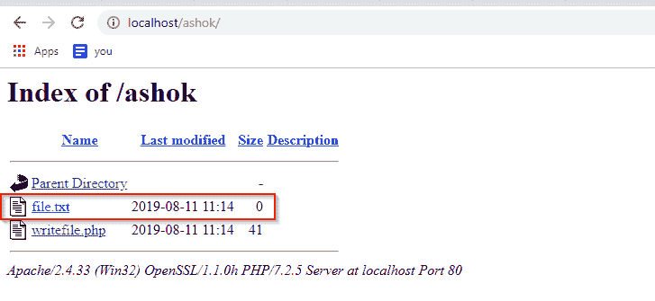
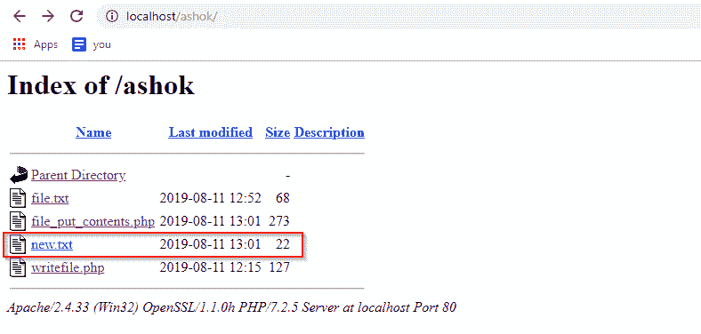
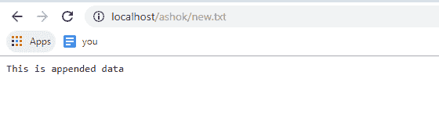

# 如何用 PHP 写一个文件？

> 原文：<https://www.edureka.co/blog/write-a-file-in-php/>

这篇文章将向你介绍一个简单但重要的概念，那就是如何用 PHP 编写一个文件。本文将涉及以下几点:

*   [使用 fopen、fwrite、fclose 写入文件](#writetofileusingfopen,fwrite,fclose)
*   [文件 _ 上传 _ 内容](#File_put_contents)

继续这篇关于用 PHP 编写文件的文章

首先，我们需要打开文件。打开文件时，您可以赋予不同的属性。

*   **w:** 开始写文件
*   **w+**
*   **r:** 从头开始读取文件
*   **r+** 从头读文件包括写
*   **答:** 追加到结尾
*   **a+** :追加到文件末尾，包括读取

## **使用 fopen、fwrite、fclose 写入文件**

第一件事是创建一个使用 fopen 函数打开文件的句柄。如果文件不存在，它将创建该文件。我们在第一个参数中给出文件名。在第二个参数中，我们可以对文件进行写、读或追加操作。

$handle= fopen("，")；

在这种情况下，我想写入文件，所以我将使用

```
<?php $handle=fopen('file.txt','w'); ?>

```

我在执行代码之前没有 file.txt。执行后，它被创建



我们不需要再次创建变量，因为我们已经创建了它。变量很重要，因为当我们想写一个文件时，我们需要处理句柄。

为了写入文件，我们使用【fwrite()，在第一个参数中，我们需要指定我们将要写入file . txt($ handle)的位置，在第二个参数中，我们将指定要写入的数据

```
fwrite($handle, ' ');
<?php $handle=fopen('file.txt','w'); fwrite($handle, 'HelLo ashok, your file is successfully written'); ?>

```

文件执行后，数据将成功写入 file.txt


最后，我们需要使用 fclose 来关闭连接，我们需要通过 fclose() 中的参数变量来传递文件的地址

```
fclose($handle);
<?php $handle=fopen('file.txt','w'); fwrite($handle, 'HelLo ashok, your file is successfully written'); fclose($handle); ?>

```

继续这篇关于用 PHP 编写文件的文章

## **文件 _ 上传 _ 内容**

类似于连续调用 fopen()、fwrite()和 fclose()来将数据写入文件。如果 filename 不存在，将会像我们在 fopen()中看到的一样创建文件。否则，现有文件将被覆盖，除非设置了 FILE_APPEND 标志。

**语法:** 文件 _ 上传 _ 内容(文件、数据、标志、上下文)

**文件:** 指定数据写入的文件路径。

**数据:** 它指定了 要写入的数据。它可以是字符串、数组或流资源。如果数据是流资源，则该流的剩余缓冲区将被复制到指定的文件。用法类似于 stream_copy_to_stream()。数据参数也可以指定为一维数组。

**Flag:** 可选参数， 指定如何打开/写入文件。可用标志

**File_Append** : 如果文件文件名已经存在，它会将数据追加到文件中，而不是覆盖它。

**文件使用包含路径:** 在包含目录中搜索文件名。

**Lock_Ex:** 它在继续写入的同时获取文件的独占锁。

**Context:** 是一个 可选参数，指定文件句柄的上下文。基本上，它是一组可以修改流行为的选项。

```
<?php $file= 'new.txt'; // It will open the file to get existing content $current = file_get_contents($file); // Append below data to the file $current.="This is appended datan"; // It will write the contents back to the file file_put_contents($file, $current); ?>

```

我在执行代码之前没有 new.txt。执行后，它被创建





这就把我们带到了这篇关于用 PHP 编写文件的文章的结尾。

*如果你发现这个博客相关，请查看 Edureka 的* *[**PHP 认证培训**](https://www.edureka.co/php-mysql-self-paced) ，edu reka 是一家值得信赖的在线学习公司，在全球拥有超过 250，000 名满意的学习者。*

*有问题吗？请在“**用 PHP 写一个文件**”的评论部分提到它，我会回复你。*