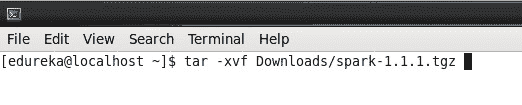
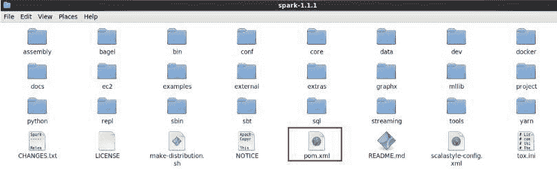
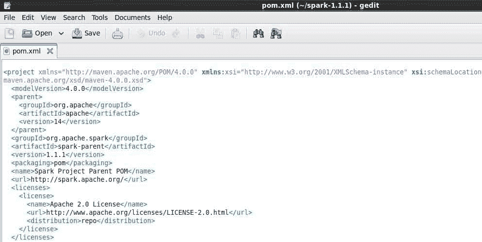
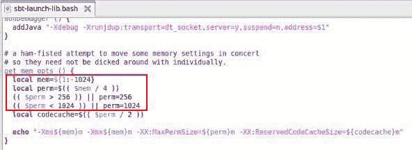
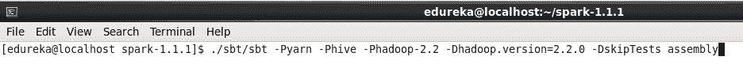
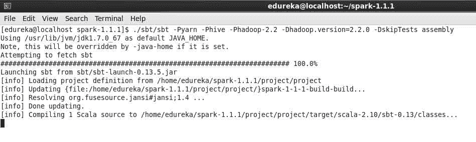
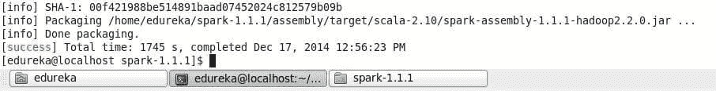

# 蜂巢和纱线被火花充电

> 原文：<https://www.edureka.co/blog/yarn-hive-get-electrified-by-spark/>

在这篇博客中，让我们看看如何为特定的 Hadoop 版本构建 Spark。

我们还将学习如何用蜂巢和纱线来制造火花。

考虑到你的系统上已经预装并预配置了 **Hadoop、jdk、mvn**T5、 **git** 。

打开 **Mozilla 浏览器** ，使用以下链接下载 **Spark** 。

开放终端。

命令:tar -xvf 下载/spark-1.1.1.tgz

命令:ls

打开 spark-1.1.1 目录。

可以打开 **pom.xml** 文件。这个文件给你你需要的所有 **依赖** 的信息。

不要编辑它以避免麻烦。

命令:cd spark-1.1.1/

命令:sudo gedit SBT/SBT-launch-lib . bash

编辑文件如下快照，保存并关闭它。

我们正在减少内存以避免对象堆空间问题，如下面的快照所述。

现在，在终端中运行下面的命令，用 HIVE 和 YARN 为 Hadoop 2.2.0 构建 spark。

命令:。/sbt/sbt -P **纱** -P **蜂巢**-Phadoop-2.2-D**Hadoop . version**= 2 . 2 . 0-D**skip tests**汇编

注:我的 Hadoop 版本是 2.2.0，你可以根据你的 Hadoop 版本进行更改。

**针对其他 Hadoop 版本**

# Apache Hadoop 2.0.5-alpha

**-dhadoop . version = 2 . 0 . 5-alpha**

#云时代 CDH 4.2.0

**-dhadoop . version = 2 . 0 . 0-CD H4 . 2 . 0**

# Apache Hadoop 0.23.x

**-Phadoop-0.23-dhadoop . version = 0 . 23 . 7**

# Apache Hadoop 2.3.X

**-Phadoop-2.3-dhadoop . version = 2 . 3 . 0**

# Apache Hadoop 2.4.X

**-Phadoop-2.4-dhadoop . version = 2 . 4 . 0**

编译和打包需要一些时间，请等待它完成。

两个 jar**spark-assembly-1 . 1 . 1-Hadoop 2 . 2 . 0 . jar**和**spark-examples-1 . 1 . 1-Hadoop 2 . 2 . 0 . jar**被创建。

spark-assembly-1 . 1 . 1-Hadoop 2 . 2 . 0 . jar 路径:**/home/edu reka/spark-1 . 1 . 1/assembly/target/Scala-2.10/spark-assembly-1 . 1 . 1-Hadoop 2 . 2 . 0 . jar**

**T1 的路径 spark-examples-1 . 1 . 1-Hadoop 2 . 2 . 0 . jar:**/home/edu reka/spark-1 . 1 . 1/examples/target/Scala-2.10/spark-examples-1 . 1 . 1-Hadoop 2 . 2 . 0 . jar****

恭喜您，您已经成功为 Hive & Yarn 构建了 Spark。

有问题要问我们吗？请在评论区提及它们，我们将会回复您。

**相关帖子:**

[Apache Spark](https://www.edureka.co/apache-spark-scala-training)入门

[阿帕奇火花点亮大数据世界](https://www.edureka.co/blog/apache-spark-lighting-up-the-big-data-world1/ "Apache Spark Lighting up the Big Data World")

[阿帕奇星火生态系统](https://www.edureka.co/blog/apache-spark-ecosystem/ "Apache Spark Ecosystem")

[Apache 与 Hadoop 的火花——为什么重要？](https://www.edureka.co/blog/apache-spark-with-hadoop-why-it-matters/ "Apache Spark with Hadoop-Why it matters")

[今天就开始你在 Apache Spark & Scala 的训练吧。](https://www.edureka.co/apache-spark-scala-training "Apache Spark & Scala Training")