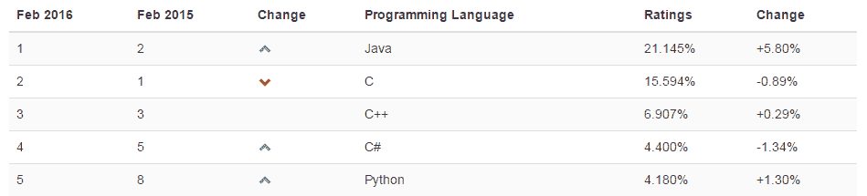
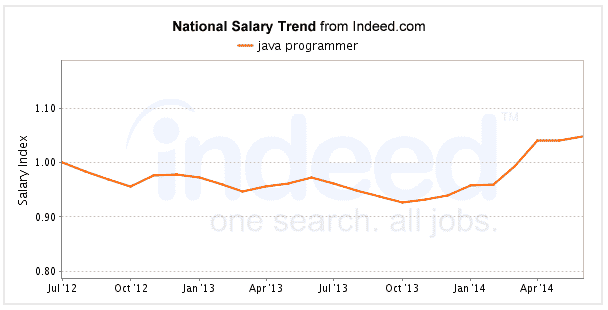
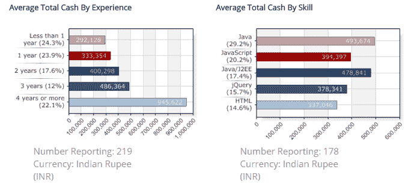
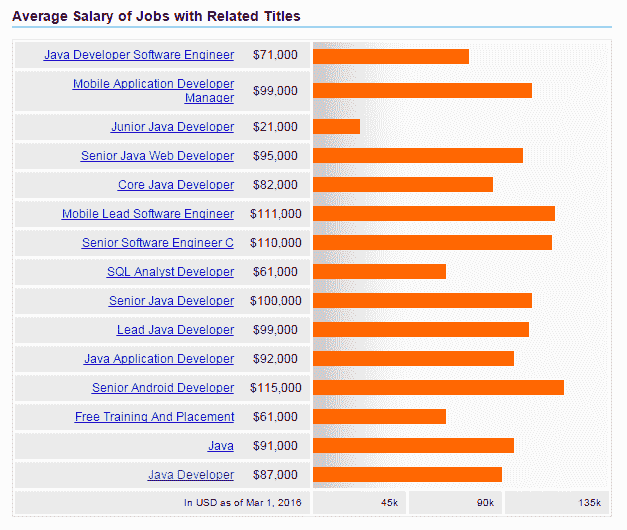

# Java 职业机会指南:如何获得顶级 Java 工作

> 原文：<https://www.edureka.co/blog/your-guide-to-java-career-opportunities-how-to-bag-top-java-jobs>

20 年的 Java 和成功党继续。对于那些认为 Java 正在逐渐失去人气的人，工作趋势的回应是“还没有”！我们不需要看得比 2016 年的 TIOBE 编程社区指数更远，就能看到 Java 的持续增长，自 2014 年以来已经获得了大约 6%的份额，被命名为年度编程语言。同样重要的是，TIOBE 指数是基于搜索引擎统计数据和一些因素，比如全球熟练工程师的数量、课程和使用编程语言的第三方供应商。这不是 Java 第一次获得冠军，而且看起来也不像是最后一次。

Java 被广泛认为是开发人员社区中“最可靠的编程语言”,它的使用和受欢迎程度在持续增长。随着对 Java 开发人员的需求预计在未来几年持续增长，这对 Java 职业机会有明显的影响。

## Java 职业机会

Java 目前在企业后端市场和 Android 移动应用程序开发市场处于领先地位。当你考虑到现代语言特性的集成，比如 JDK 8 中的 lambda 表达式和流，Java 的未来看起来是光明的。据 Oracle 称，世界上有 900 万 Java 开发人员出于许多原因继续使用 Java，如实用性、兼容性、可靠性和易用性。随着在 JDK 10 中引入新的语言特性(如值类型)的计划已经在进行中，Java 很可能成为本年度甚至十年后的编程语言！

## Java 相对于其他编程语言的受欢迎程度

资料来源:Tiobe.com

## Java 编程工资

根据 Indeed.com 的数据，美国 Java 开发人员的平均工资是 102，000 美元，全国范围内的招聘工资比平均工资高出 77%。下图显示了美国 Java 编程的工资增长趋势。

在印度，情况并无不同。据 Payscale.com 称，在印度，Java 程序员/开发人员的平均总收入为 436，104 卢比，总收入随着经验水平的提高而增加。

## Java 工作角色

以下是一些适合具有 Java 技能的专业人员的工作角色:

*   Java 开发者
*   Java 架构师
*   Web 开发人员
*   数据库管理员

相应 Java 工作角色的平均工资(美国)如下所示:

资料来源:Indeed.com

## 热门 Java 程序员技能

一个顶尖的 Java 程序员，将精通以下技能:

*   企业 Java Beans
*   Oracle 数据库 SQL 和 JDBC
*   XML，X 查询，XSL
*   J2EE 框架
*   JSP
*   面向服务的架构
*   基于 Java 的 Web 服务
*   Java Servlet 技术

全球各地都有大量的 Java 职业机会。在 Indeed.com 上快速搜索一下就会发现，一些知名的公司，如亚马逊网络服务、IBM、微软、甲骨文、思科系统、Akamai 技术、摩根大通和惠普企业等，都在寻找 Java 开发人员。提升技能和利用 Java 职业机会的时机已经成熟。

Edureka 有一个特别策划的 Java/J2EE 和 SOA 课程，旨在让您在高级 Java 编程方面有一个良好的开端，并培训您核心和高级 Java 概念以及各种 Java 框架，如 Hibernate Spring。 *本课程新批次即将开始。点击 [此处](https://www.edureka.co/java-j2ee-soa-training "Get started with Java/J2EE and SOA") 了解更多。*

有问题要问我们吗？请在评论区提到它，我们会给你回复。

**相关帖子:**

[Java/J2EE 和 SOA 入门](https://www.edureka.co/java-j2ee-soa-training "Get started with Java/J2EE and SOA")

[2016 年顶级 Java 面试试题](https://www.edureka.co/blog/interview-questions/top-java-interview-questions-2016/ "Top Java interview questions")

[关于 Java 你需要知道的一切](https://www.edureka.co/blog/java-tutorial/ "Java training with Edureka")