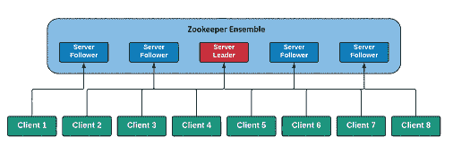
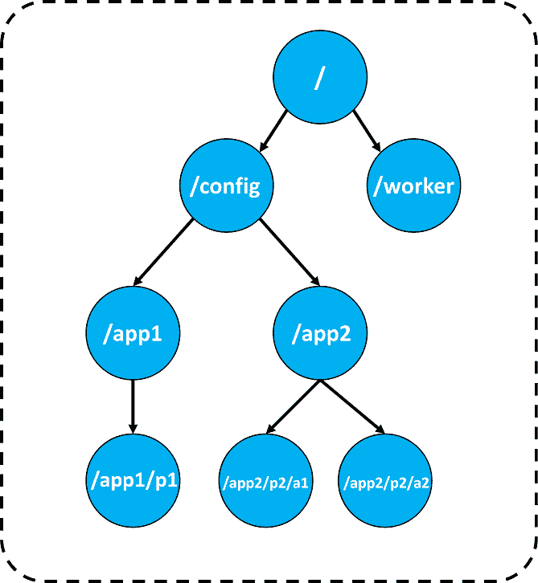
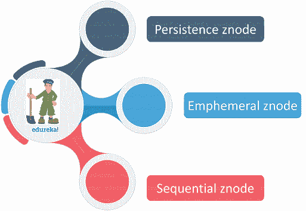
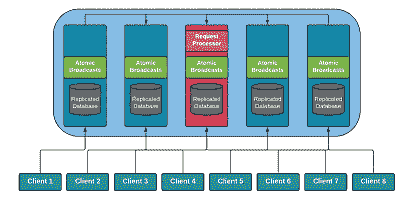

# 动物园管理员教程:你需要掌握动物园管理员的指南

> 原文：<https://www.edureka.co/blog/zookeeper-tutorial/>

[**Apache Zookeeper**](https://www.edureka.co/big-data-hadoop-training-certification) 是顶尖的集群协调服务之一，它使用最健壮的同步技术来保持节点完美连接。Zookeeper 以其简单的架构和个性化的 API 解决了分布式环境的*管理*。

*   [动物园管理员的建筑](#arch)
*   [动物园管理员数据模型](#model)
*   [Zookeeper 中的节点类型](#node)
*   动物园管理员合奏
*   [动物园管理员安装](#install)
*   [Zookeeper 命令行界面](#cli)
*   [公司使用动物园管理员](#company)

## **什么是动物园管理员？**


Zookeeper 是一个由 Apache 基金会提供的集群协调、跨平台软件服务。本质上是为分布式系统提供服务，提供分层  键值存储，用于为大型分布式系统提供分布式配置服务、同步服务和命名注册表

## **动物园管理员的建筑**

Apache Zookeeper 基本上遵循客户端-服务器架构。Zookeeper 架构的参与者可以按如下方式招募。



Apache Zookeeper 的架构分为以下 5 个不同的部分:

*   全体
*   计算机网络服务器
*   服务器领导者
*   属下
*   客户

**合**

它基本上是 Zookeeper 生态系统中所有服务器节点的集合。集合最少需要三个节点来建立自己。

**服务器**

它是 Zookeeper Ensemble 中的一个服务器，其目标是为客户提供各种服务。它向其客户端发送其活动状态，以便通知其客户端其可用性。

**服务器领导**

在服务启动时选出合奏团团长。它可以从任何故障节点恢复数据，并为客户端执行自动数据恢复。

**跟随者**

跟随者是群体中的一个服务者。它的职责是执行领导下达的命令。

**客户端**

客户端是向服务器请求服务的节点。与服务器类似，客户机也向服务器发送有关其可用性的信号。如果服务器没有响应，它们会自动将自己重定向到下一个可用的服务器

接下来，在这篇 zookeeper 教程文章中，我们将学习 Zookeeper 的数据模型。

## **动物园管理员数据模型**

Zookeeper 数据模型遵循分层命名空间，其中每个节点被称为一个 **Znode，**集群运行的系统的一部分。在下图中，你可以看到 Znode 被一个 **'/'** 隔开。考虑到作为一个**根，**根下面还有两个名称空间。

这两个节点是名称空间。 **config** 命名空间用于集中配置， **workers** 命名空间用于命名过程。数据模型的主要用途是维护 zookeeper 集群中的同步，并解释每个 **Znode 的元数据。**



现在，让我们来了解一下 znodes 的类型。

## **Zookeeper 中的节点类型**

有下面提到的三种类型的节点。



**余辉 Znode**

系综中的所有节点都假定自己是持久性节点。即使在客户端断开连接后，这些节点也倾向于保持活动状态。

**短暂的锌电极**

这些类型的节点保持活动状态，直到客户端连接到它们。当客户端断开时，他们就死了。这些类型的节点不允许有子节点。

**顺序 Znode**

它可以是持续的 Znode，也可以是短暂的 Znode。当一个节点被创建为一个连续的 Znode 时，那么您可以通过在原始名称上附加一个 10 位数的序列号来分配 Znode 的路径。

**会话和手表**

**会话**

会话是分配给每个客户端用于接收服务的时间间隔。为每个客户端提供一个会话 ID，并按顺序提供服务。每个客户端都向服务器发送一个心跳，以保持会话有效。如果在超过会话超时间隔的时间内没有接收到心跳，则服务器认为客户端已经死亡

**手表**

这些只是给客户端的通知。每当集合发生变化时，客户都会收到来自集合的通知，告知手表的形式发生了变化。

## 动物园管理员合奏

在 Zookeeper 集合的开始，客户端尝试连接到集合中的一个节点。一旦连接上，服务器节点就向客户机发送确认信息。反过来，客户端发送心跳来确认其连接。

如果客户端需要从服务器读取数据，那么它会向服务器发送要读取的数据的 znode 路径。动物园管理员向客户提供所需的信息。

如果客户机需要存储信息，那么客户机发送客户机希望存储数据的 znode 路径。该信息首先被发送给乐团团长。系综领导者将写命令转发给所有跟随者。只有当大多数跟随者做出肯定响应时，才会处理**写**请求

下图描绘了动物园管理员合奏。每个动物园管理员合奏都有一些限制。让我们讨论这些。



局限性:

*   我们无法实时建立一个只有一个节点的动物园管理员集合。因为，一个节点的故障会导致整个集群的故障。

*   在集群中有两个节点的情况下，我们甚至会失败，因为一个节点不能被认为是多数。

*   如果我们有三个节点，其中一个出现故障，那么我们可以将剩余的节点视为大多数。

*   因此，我们希望提供动物园管理员的最低要求，以获得一个稳定的群体。

接下来，在这篇 zookeeper 教程文章中，我们将学习 Zookeeper 的安装。

## **动物园管理员安装**

要将 Zookeeper 安装到您的 Linux 系统中，请完成以下步骤。

**第一步:**将 [**Java**](https://download.oracle.com/otn/java/jdk/8u231-b11/5b13a193868b4bf28bcb45c792fce896/jdk-8u231-linux-x64.tar.gz) 安装到你的本地系统中。

```
sudo apt install openjdk-8-jdk-headless
```

**第二步:**下载最新版本的 Zookeeper 到你的 Ubuntu 本地系统。

**步骤 3:** 使用下面的命令提取 tar 文件。

```
tar -xvf apache-zookeeper-3.5.6-bin.tar.gz
```

第四步:建立 Zookeeper 配置文件。

```
# The number of milliseconds of each tick
tickTime=2000
# The number of ticks that the initial 
# synchronization phase can take
initLimit=10
# The number of ticks that can pass between 
# sending a request and getting an acknowledgement
syncLimit=5
# the directory where the snapshot is stored.
# do not use /tmp for storage, /tmp here is just 
# example sakes.
dataDir=/tmp/zookeeper
# the port at which the clients will connect
clientPort=2181
# the maximum number of client connections.
# increase this if you need to handle more clients
#maxClientCnxns=60
#
# Be sure to read the maintenance section of the 
# administrator guide before turning on autopurge.
#
# http://zookeeper.apache.org/doc/current/zookeeperAdmin.html#sc_maintenance
#
# The number of snapshots to retain in dataDir
#autopurge.snapRetainCount=3
# Purge task interval in hours
# Set to "0" to disable auto purge feature
#autopurge.purgeInterval=1
```

**第五步:**启动 Zookeeper 服务器

```
./zkServer.sh start
```

**第六步:**启动客户端界面

```
./zkSCli.sh
```

您的 Zookeeper 已成功安装并运行。

类似地，完成服务后，可以使用下面的命令关闭 Zookeeper。

```
./zkServer.sh stop
```

现在，让我们进入命令行界面

## **Zookeeper 命令行界面**

ZooKeeper 命令行界面，或者简而言之，CLI 是为开发程序与 ZooKeeper ensemble 交互而设计的。它的主要目的是调试和处理不同的过程选项。

为了执行任何 ZooKeeper CLI 操作，我们需要打开您的 ZooKeeper 服务器。然后，动物园管理员客户端。一旦客户端启动，您就可以执行以下操作。

*   **创建节点**

在集群中创建新节点

```
create /EdurekaZnode &ldquo;Edurekazookeeper-app&rdquo;
```

**//输出:**

`[zk: localhost:2181(CONNECTED) 0] create /EdurekaZnode “Edurekazookeeper-app”`

创建**顺序 Znode**

```
create -s /EdurekaZnode data
```

**//输出:**

`[zk: localhost:2181(CONNECTED) 2] create -s /EdurekaZnode “data”`

创造短暂的锌电极

```
create -e /EdurekaZnode2 &ldquo;Ephemeral&rdquo;
```

**//输出:**

`[zk: localhost:2181(CONNECTED) 2] create -e /EdurekaZnode2 “Ephemeral”`

*   **获取数据**

返回 znode 的关联数据和指定 znode 的元数据。

```
get /EdurekaZnode
```

**//输出:**

`[zk: localhost:2181(CONNECTED) 1] get /EdurekaZnode`

为了访问下一个**顺序 znode，**你需要输入 **znode 的完整路径。**

```
get /EdurekaZnode0000000052
```

**//输出:**

`[zk: localhost:2181(CONNECTED) 1] get /EdurekaZnode0000000052``“data”``cZxid = 0xx22``ctime = Sat Dec 28 17:35:55 IST 2019``mZxid = 0xx22``mtime = Sat Dec 29 17:35:55 IST 2019``pZxid = 0xx22``cversion = 0``dataVersion = 0``aclVersion = 0``ephemeralOwner = 0x0``dataLength = 13``numChildren = 0`

*   **观察 znode 的变化**

通知客户系综变化的过程

```
get /EdurekaZnode 1
```

**//输出:**

`WATCHER: :`

`WatchedEvent state:SyncConnected type:NodeDataChanged path:/EdurekaZnode 1``cZxid = 0xx21f``ctime = Sat 28 17:42:28 IST 2019``mZxid = 0xx21f``mtime = Sat Dec 28 17:42:28 IST 2019``pZxid = 0xx21f``cversion = 0``dataVersion = 0``aclVersion = 0``ephemeralOwner = 0x0``dataLength = 32`

*   **设定数据**

设定指定 znode 的数据。

```
set /EdurekaZnode2 updatedata
```

**//输出:**

`[zk: localhost:2181(CONNECTED) 1] get /EdurekaZnode2 “updatedata”``cZxid = 0xx22``ctime = Sat Dec 28 17:55:20 IST 2019``mZxid = oxx22``mtime = Sat Dec 28 17:55:20 IST 2019``pZxid = 0xx22``cversion = 0``dataVersion = 1``aclVersion = 0``ephemeralOwner = 0xx16016e32db00012``dataLength = 32`

*   **创建 znode 的子节点**

创建从属子节点

```
create /EdurekaZnode/Child1 EdurekaChild
```

**//输出:**

`[zk: localhost:2181(CONNECTED) 16] create /EdurekaZnode/Child1 “EdurekaChild”`

*   **列出 znode 的子节点**

我们可以列出并显示 znode 的  **子节点**

```
ls /EdurekaZnode
```

**//输出:**

`[zk: localhost:2181(CONNECTED) 2] ls /EdurekaZnode`

*   **检查状态**

它可用于描述指定 znode 的元数据。

```
stat /EdurekaZnode
```

**//输出:**

`[zk: localhost:2181(CONNECTED) 1] stat /EdurekaZnode``cZxid = 0xx21f``ctime = Sat 28 18:04:26 IST 2019``mZxid = 0xx21f``mtime = Sat Dec 28 18:04:26 IST 2019``pZxid = 0xx21f``cversion = 0``dataVersion = 0``aclVersion = 0``ephemeralOwner = 0x0``dataLength = 32`

*   **移除一个 znode**

移除指定的 znode 并递归移除其所有子节点。

```
rmr /EdurekaZnode
```

**//输出:**

`[zk: localhost:2181(CONNECTED) 20] rmr /EdurekaZnode``[zk: localhost:2181(CONNECTED) 21] get /EdurekaZnode`

## **使用 Zookeeper 的公司**

有很多公司在使用 Apache Zookeeper。下面列出了几个使用 Zookeeper 的大公司。


至此，我们结束了这篇《*动物园管理员教程*》的文章**。** 我希望我已经让你对 **动物园管理员有所了解。**

*既然你已经从这篇 Zookeeper 教程文章中理解了 Zookeeper 的基本概念，那么就来看看 Edureka 的  **[Hadoop 培训](https://www.edureka.co/big-data-hadoop-training-certification)*** *吧，edu reka 是一家值得信赖的在线学习公司，在全球拥有超过 250，000 名满意的学习者。Edureka 大数据 Hadoop 认证培训课程使用零售、社交媒体、航空、旅游、金融领域的实时用例，帮助学员成为 HDFS、Yarn、  [MapReduce](https://hadoop.apache.org/docs/current/hadoop-mapreduce-client/hadoop-mapreduce-client-core/MapReduceTutorial.html) 、Pig、Hive、HBase、Oozie、Flume 和 Sqoop 领域的专家。*

如果你对这篇“动物园管理员教程”有任何疑问，请在下面的评论区给我们写信，我们会尽快回复你。